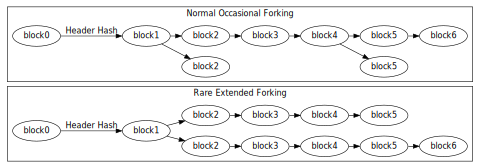

### 区块高度及分叉 | Block Height And Forking

任何成功计算出那个比目标阈值低的区块头哈希值的矿工，都可以将这整个区块加到区块链中（假设这个区块是有效的）。这些区块通常是通过区块高度来定位的，所谓区块高度是指某个区块与比特币第一个区块（及区块 0，众所周知的创世区块）之间的区块个数。比如，区块 2016 就是第一次难度调整的位置。

多个区块可以具有同样的区块高度，这在两个或更多的矿工同时创建一个区块时是很常见的。这导致了如上图所示的明显的分叉。

最终，矿工会产出一个新的区块，它附加在且仅附加在同时被挖出的区块中的一个之后。这样使得某一个分叉比其他分叉更为健壮。假设一个分叉只包括有效的区块，普通的节点总是跟随更长的链，而放弃陈旧的短的分叉。（陈旧的区块常常被叫做孤链，但是该术语也被用于描述确实没有父区块的区块。）

如果一些矿工有其他的意图，长期的分叉是有可能出现的，比如一些矿工在延续区块链工作，而同时另一些矿工试图通过发起 51％ 攻击篡改交易纪录。

因为多个区块可以在区块链分叉时具有同样的区块高度，所以区块高度不应该用来做全局的唯一标示符。通常，区块使用区块头的哈希值来做标示（大多数时候是字节倒序的十六进制表示）。