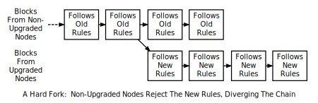
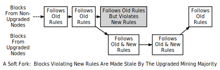

### 一致性规则变更 | Consensus Rule Changes

为了维持一致性，所有的完整节点使用相同的一致性规则验证区块。然后，有时为了加入新特性或者防治[网络](https://bitcoin.org/en/developer-guide#term-network)滥用一致性规则会被更改。当新的规则被实施后，会在一段时间内出现已更新节点遵循新的规则而未更新的节点遵循旧的规则，这导致两种可能的一致性分歧的出现：

1. 一个区块遵循新的一致性规则，它将被已更新节点接受而被未更新节点拒绝。例如，一个新的交易特性被用于区块内部，那么已更新节点便可以理解这一特性并接受它，但是未更新节点则因为它违背了旧的规则而拒绝了它。

2. 一个区块违反了新的一致性规则而被已更新节点拒绝，但却被未更新节点接受。例如，一个不合理的交易特性被用在一个区块内，已更新的节点因为新规则拒绝了它，但未更新的节点遵循旧的规则所以接受了它。

在第一种情况中，即未更新节点拒绝的情况，从未更新节点获取到区块链信息的挖矿软件会拒绝从已更新节点获取数据的挖矿软件在同一条链条上构建区块。这样导致了永久性的分叉链，一条是已更新节点的，一条是未更新节点的，这被称为[硬分叉](https://bitcoin.org/en/glossary/hard-fork)。

在第二种情况中，即已更新节点拒绝的情况，如果已更新节点掌握大部分的算力就有可能避免永久性分叉。在这种情况下，因为未更新节点会和已更新节点接受相同的区块而使已更新节点构建了更长的链，这样未更新节点便会接受更长的有效区块链。这被称作[软分叉](https://bitcoin.org/en/glossary/soft-fork)。

尽管一个分叉在区块链中是一个实实在在的分歧，但是对一致性规则的更改被经常描述为有可能出现软分叉或者硬分叉。比如，“扩展区块大小上限到 1 MB 需要一个硬分叉。”在这个例子中，一个区块链的硬分叉并不是一定需要，但是他却是一种可能的结果。

资源：[BIP16](https://github.com/bitcoin/bips/blob/master/bip-0016.mediawiki)，[BIP30](https://github.com/bitcoin/bips/blob/master/bip-0030.mediawiki) 和 [BIP34](https://github.com/bitcoin/bips/blob/master/bip-0034.mediawiki) 的实现被当作可能导致软分叉的变更。[BIP50](https://github.com/bitcoin/bips/blob/master/bip-0050.mediawiki) 描述了一种意外的硬分叉（通过暂且对已更新节点降级来化解）和一种当暂且的降低被移除后的有意的硬分叉。由 Gavin Andresen 写的一篇文档描绘[未来的规则更改该如何实现](https://gist.github.com/gavinandresen/2355445)。