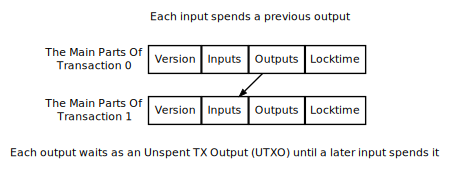
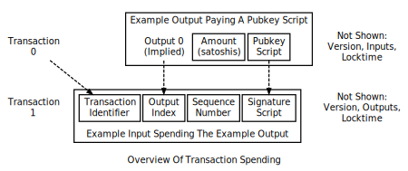
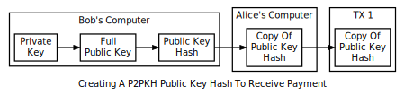

## 交易 | Transactions

交易让用户可以花费聪（satoshis）。每一笔交易是由多个部分构成的，使单纯直接的支付和复杂的交易成为可能。这一章节将对其每一部分做详解并展示如果将它们拼接起来构建一个完成的交易。

为了便于理解，这一节假设不存在 coinbase 交易。只有比特币矿工可以创建 coinbase 交易，它们对于下面会提到的很多规则都将是例外。这里并不会指出 coinbase 对哪一条规则是例外，你可以通过阅读本指南中区块链章节中的 coinbase 交易小节来做了解。

上图展示了一个比特币交易的主要部分。每一个交易至少有一个输入和一个输出。每一个输入会花费掉上一个输出的聪。一个输出会作为一个未花费交易输出（UTXO）等待着作为输入被花费掉。当你的比特币钱包显示你有 10,000 聪余额时，它真实的表意是你有 10,000 聪作为 UTXOs 在等待着。

每一个交易具有一个四字节的交易版本号，它告知比特币节点和矿工应使用哪一套规则来验证它。这使得开发者在为未来的交易创建新规则时可以不验证之前的交易。

每一个输出都有一个默认的索引数值，由其在交易中的位置决定，第一个输出就是输出零。输出包含以聪为计数单位的金额，通过满足一个特定条件的 pubkey 脚本来支付。任何可以满足 pubkey 脚本特定条件的人都可以花费对应金额的聪。

输入通过使用交易 id（txid）和输出索引数值（常被称为输出向量的"vout"）来辨识哪一个输出被花费。它同时包含一个签名脚本，这个脚本提供数据作为参数来满足 pubkey 脚本的特定条件。（序列数值和锁定时间是关联的，将会在后续小节中被一起涵盖。）

下图展示了使用这些特性的一个流程，Alice 给你 Bob 发送了一个交易，使得 Bob 之后可以花费这个交易。Alice 和 Bob 使用了支付给公开哈希（P2PKH）这种常用的交易类型。P2PKH 让 Alice 可以发送 satoshis 到一个比特币地址，然后让 Bos 之后可以花费这些 satoshis，其实使用了了一个简单的密码密钥对。

Bob 必须在 Alice 能够发给他交易前就生成一对私有/公开密钥对。比特币使用椭圆曲线数字签名算法（ECDSA），选用的是 secp256k1 曲线，secp256k1 的私钥是 256 位的随机数据。这份数据的副本可以被准确的转化为 secp256k1 的公钥。因为转化可以在之后被准确的进行，公钥是没有存储的必要性的。

然后公钥（pubkey）进行密码哈希。这个公钥哈希之后也可以准确的算出，所以它也是不需要被存储的。这个哈希缩短并混淆了公钥，使得手动的交易更容易并提供了安全性，用以抵抗一些未曾预料的问题，比如在未来可能出现通过公钥重新构建出私钥。

Bob 提供给 Alice 公钥哈希。公钥哈希通过编码后就得到了比特币地址，使用 base58 编码得到的字符串包含了一个地址版本数字、哈希值和一个错误校验的校验和用来捕获错别字。比特币地址可以通过任何媒介传播，包括单向媒介从而省去了消费者与接收者间的沟通，它可以之后编码为任何其他格式，比如一个包含了 `bitcoin:` URI 的二维码。